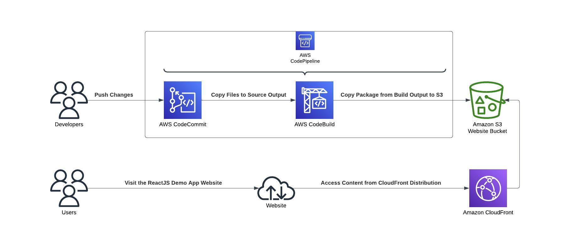

# Table of Contents
1. [About The Project](#about-the-project)
    * [Built With](#built-with)
2. [Getting Started](#getting-started)
    * [Prerequisites](#prerequisites)
    * [Installation](#installation)
3. [Usage](#usage)
4. [Test](#test)
5. [Changelog](#changelog)
6. [License](#license)
7. [Links](#links)

## About The Project

This is a terraform project to provision a demo ReactJS application, which is placed on an S3 bucket enabled as a static website hosting.
A Cloudfront distribution will be configured in front of the S3 bucket in order to provide AWS Shield protection and CDN (Content Delivery Network) capabilities.

When you create a distribution, CloudFront provides a domain name for the distribution, such as d111111abcdef8.cloudfront.net.
A default SSL certificate is also provided by CloudFront.

If you want to use your own domain name, such as www.example.com, instead of the cloudfront.net domain name, you can add an alternate domain name to your distribution. You will also need to upload or create a valid SSL certificate on ACM (Amazon Certificate Manager), and make use of it in the Cloudfront distribution configuration. Then you will have to create a new CNAME record for your own domain pointing at Cloudfront domain name of your distribution.

Static ReactJS code will be built, tested and deployed through a CI/CD implemented with AWS CodeCommit, CodeBuild and CodePipelines.

This project provides configuration for a development environment (dev), but new environments can be added when necessary.

### Built With

Terraform scripts will be used to easily provision resources from the infrastructure provider.
For this project we'll use AWS as cloud provider. So, a valid AWS is needed to create all the resources we need.
You can also sign up for a free tier account (See the links section).
The application used as an example is written in ReactJS. See the links section to know how to create a new ReactJS app demo application.

## Getting Started

This project includes the creation of a CI/CD pipeline implemented with AWS CodePipeline, that will retrive the source code from a git repository on CodeCommit, will build the ReactJS static files in CodeBuild, and deploy the output files to an S3 bucket.
The website will be accessed through a CloudFront distribution linked to the S3 bucket.

You can see all the pieces together in the next diagram.



### Prerequisites

To connect Terraform to your AWS account you will need to create an access key with programmatic access.
Then you'll be provided with a new access key and a secret key.
You can create an AWS profile on your computer or add your access_key and secret_key on the provider configuration block in the provider.tf file.

We'll need to create an S3 bucket to remotely save the state of your Terraform changes applied to AWS.
It is recommended to use a remote bucket to avoid drifting conflicts between developers when applying Terraform changes.
If we also want to avoid concurrency errors when can use state locking on a DynamoDB table (See the links section).

In order to check AWS configurations and the creation of resources and services we'll need to install the AWS client application (See the links section).

### Installation

In order to check AWS configurations and the creation of resources and services we'll need to install the AWS client application (See the links section).

We can create a new AWS profile. If we name it "default", we won't need to referent it in all AWS CLI commands.
If you already have an AWS profile created for other purposes, backup your ~/.aws/config and ~/.aws/credentials files.

```sh
mkdir ~/.aws
echo -e "[profile default]\nregion = us-east-1\noutput = json" > ~/.aws/config
echo -e "[default]\naws_access_key_id = AWS_ACCESS_KEY >\naws_secret_access_key = AWS_SECRET_KEY" > ~/.aws/credentials
```

If you prefer to create your infrastructure in a different region than "us-east-1", feel free to change it in the config file.
Replace "AWS_ACCESS_KEY" and AWS_SECRET_KEY with yours.

To check the profile is correctly configured execute the command:
```sh
aws configure
```

Generate a unique name for the S3 backend bucket used to store the Terraform state.
```sh
TFSTATE_BUCKET="tfstate-sandbox-$(date +%s)"
echo $TFSTATE_BUCKET
```

You can create the S3 bucket using de AWS interactive dashboard or directly with an aws cli command:
```sh
aws s3api create-bucket --bucket $TFSTATE_BUCKET --region us-east-1
```

If we want to enable server-side encryption then execute:
```sh
aws s3api put-bucket-encryption --bucket $TFSTATE_BUCKET --server-side-encryption-configuration '{"Rules": [{"ApplyServerSideEncryptionByDefault": {"SSEAlgorithm": "AES256"}}]}'
```

To check if the bucket is created execute the command:
```sh
aws s3api list-buckets
```

Update the backend section in file ./envs/dev/provider.tf with the new bucket name.

Install the Terraform CLI application (see the links section).

## Usage

First we have to change directory to the environment folder. In our case its envs/dev.
```sh
cd envs/dev
```

To initialize the working directory containing Terraform configuration files execute the command: 
```sh
terraform init
```

If we are changing the Terraform state backend we will be prompted to execute:
```sh
terraform init -reconfigure
```

To validate our Terraform configuration files we can execute:
```sh
terraform validate
```

To create an execution plan, which lets us preview the changes that Terraform plans to make to our infrastructure, execute:
```sh
terraform plan
```

To apply the actions proposed in the execution plan execute:
```sh
terraform apply
```

Write "yes" when being asked for confirmation.

Once Terraform has finished executing, it will display six output values:
* cdn_domain_name
* codebuild_name
* codepipeline_name
* repository_url_http
* repository_url_ssh
* website_endpoint

You can visit the website browsing the cdn_domain_name (something similar to d111111abcdef8.cloudfront.net).

You will notice that we get a 404 NoSuchKey error. That's because we have not yet uploaded the code.
But we are not going to upload any code. We are going to push code to the newly create source repository
That will triger a deployment pipeline that will finally copy the optimized static website code to its corresponding S3 bucket.

We can clone the git repository using repository_url_http or repository_url_ssh.
We wil need to set up git credentials from your AWS account (See the links section).

Once the repository is cloned, we have to copy the code and push it.
You can copy your own ReactJS application or use this demo project:
https://github.com/francescvila/react-demo-app/archive/refs/heads/main.zip

Keep in mind this demo project relies on NodeJS version 14.

## Test

Once the code is pushed to the CodeCommit Repository (reactapp-web-repo-dev) you will see a deployment pipeline trigered on AWS CodePipeline.
Once the three stages of the pipeline (Source, Build, Deploy) have finished executing, you may browse the CloudFront domain name.
You'll see displayed the ReactJS app home page in all its glory.

If you curl the CloudFront domain name you should get an HTTP 200 response code.
```sh
curl -I https://<cloudfront_domain_name>
```

Any new changes deployed to the CodeCommit git repository will be deployed the same way throughout the pipeline.

We can check all the infrastructure created browsing the AWS management console:
* S3: https://s3.console.aws.amazon.com/s3/buckets?region=us-east-1
* CloudFront: https://us-east-1.console.aws.amazon.com/cloudfront/v3/home#/distributions
* CodeCommit: https://us-east-1.console.aws.amazon.com/codesuite/codecommit/repositories?region=us-east-1
* CodePipeline: https://us-east-1.console.aws.amazon.com/codesuite/codepipeline/pipelines?region=us-east-1

We can also check what we provisioned using de AWS CLI commands:

S3
```sh
aws s3api list-buckets
```

CloudFront
```sh
aws cloudfront list-distributions
```

CodeCommit
```sh
aws codecommit list-repositories
```

CodePipeline
```sh
aws codepipeline list-pipelines
```

## Changelog

A changelog is a file which contains a curated, chronologically ordered list of notable changes for each version of a project. See `CHANGELOG.md` to follow all software changes of this project.

## License

Distributed under the Apache License 2.0. See `LICENSE.txt` for more information.

## Links

* AWS Free Tier: https://aws.amazon.com/free
* Create a New React App: https://reactjs.org/docs/create-a-new-react-app.html
* Installing or updating the latest version of the AWS CLI: https://docs.aws.amazon.com/cli/latest/userguide/getting-started-install.html
* Install Terraform: https://learn.hashicorp.com/tutorials/terraform/install-cli
* How to manage Terraform state: https://blog.gruntwork.io/how-to-manage-terraform-state-28f5697e68fa
* Setup for HTTPS users using Git credentials: https://docs.aws.amazon.com/codecommit/latest/userguide/setting-up-gc.html
